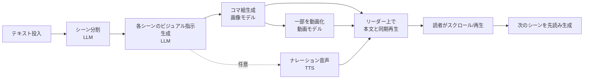
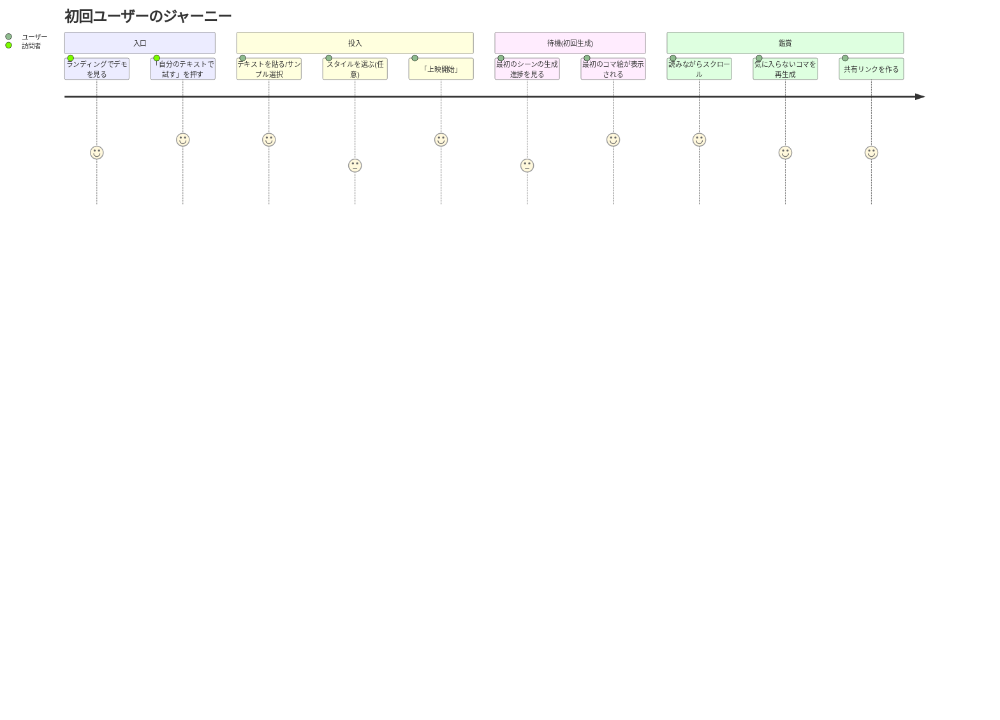
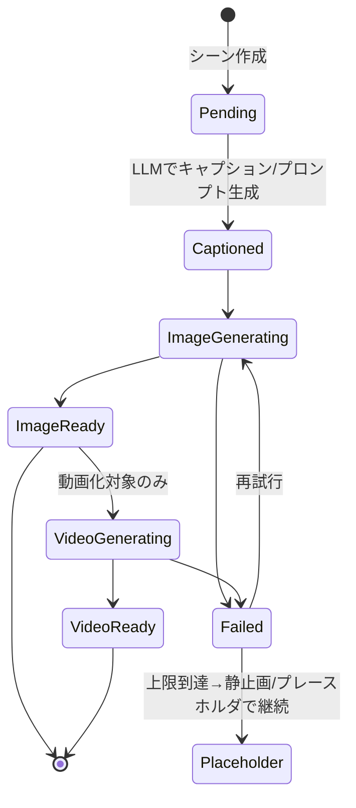
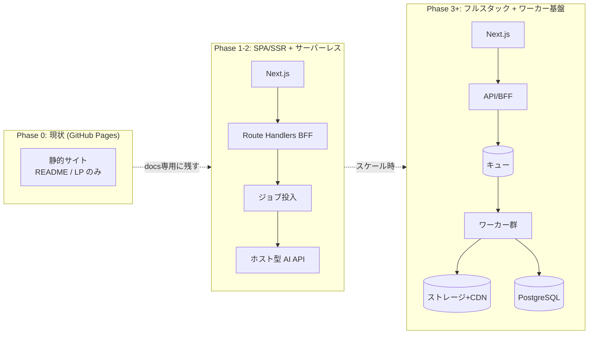
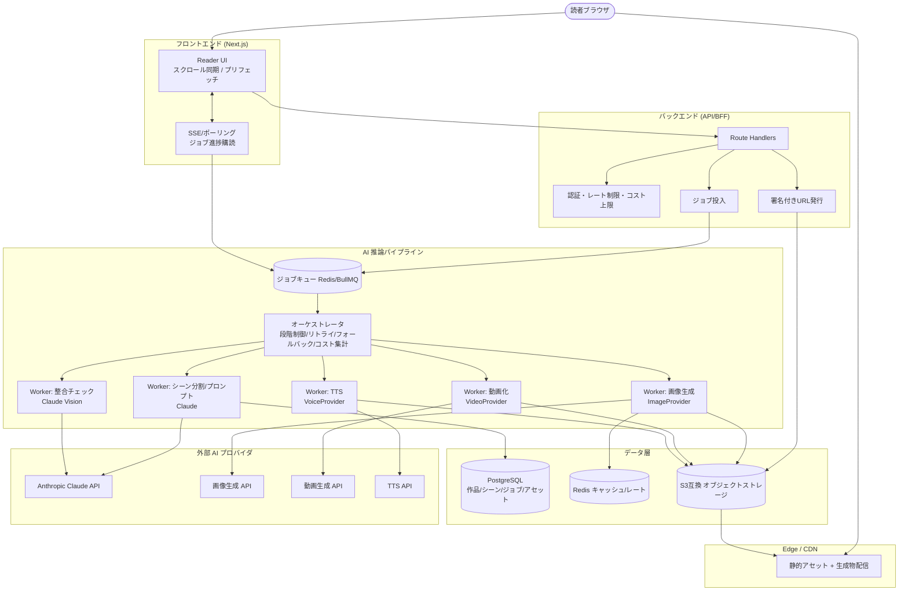
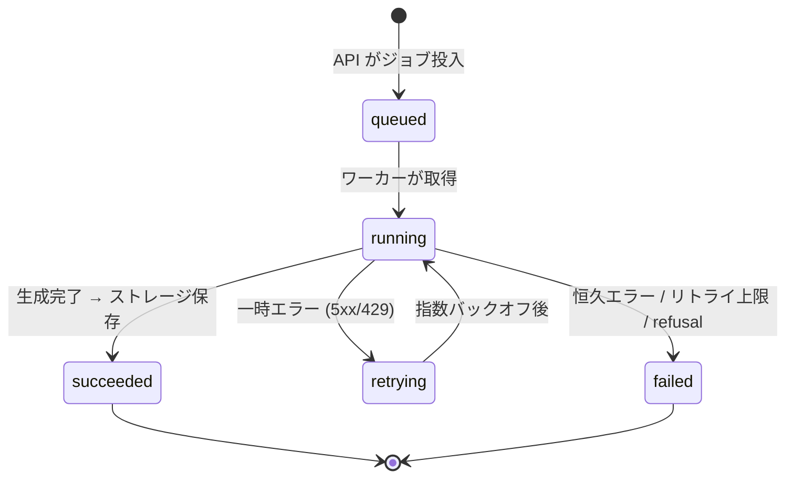
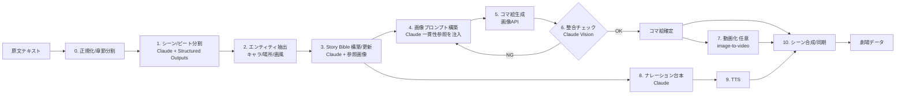
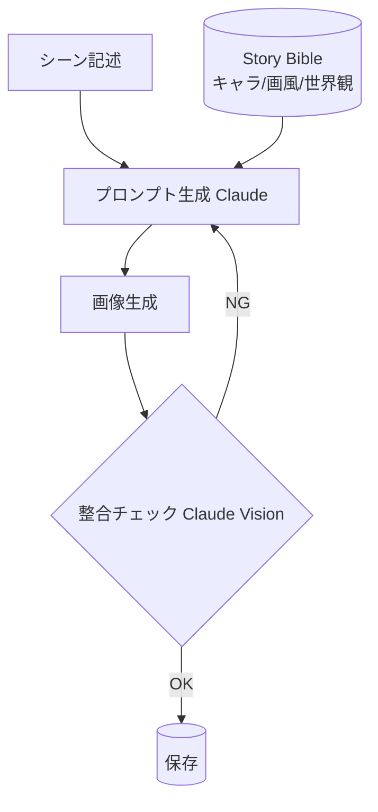

# Novel-Theater 開発計画 (PLAN.md)

> 小説・文章を、読みながらコマ絵（マンガ風パネル）と短い動画に自動変換して「観ながら読む」体験を提供する Web アプリケーション。

このドキュメントは、ゼロから本プロジェクトを立ち上げ、育てていくための包括的・実行可能な開発／アーキテクチャ計画です。**プロダクト体験（UX）を最優先**に据えつつ、それを支える**堅牢なアーキテクチャ**と**一貫性のある AI パイプライン**を組み合わせ、**薄く出荷して段階的に育てる**ことを基本方針とします。

> 注: 本計画に登場する AI モデル／API は **2026 年 6 月時点での推奨候補**です。特に画像・動画生成モデルは進化が速いため、最終採用前に必ず最新の品質・価格・商用ライセンス・地域可用性を再確認してください（§13 参照）。

---

## 目次

1. [プロジェクト概要 / ビジョン](#1-プロジェクト概要--ビジョン)
2. [ターゲットユーザーと主要ユースケース](#2-ターゲットユーザーと主要ユースケース)
3. [プロダクト体験設計 (UX)](#3-プロダクト体験設計-ux)
4. [機能要件 (MVP と将来)](#4-機能要件-mvp-と将来)
5. [技術スタック選定と根拠](#5-技術スタック選定と根拠)
6. [システムアーキテクチャ](#6-システムアーキテクチャ)
7. [AI パイプライン詳細](#7-ai-パイプライン詳細)
8. [データモデル / 主要データ構造](#8-データモデル--主要データ構造)
9. [ディレクトリ構成案](#9-ディレクトリ構成案)
10. [段階的ロードマップ / マイルストーン](#10-段階的ロードマップ--マイルストーン)
11. [非機能要件](#11-非機能要件)
12. [リスクと対策](#12-リスクと対策)
13. [未決事項 / 要確認 (Open Questions)](#13-未決事項--要確認-open-questions)
14. [付録: Phase 0 を明日から始めるチェックリスト](#14-付録-phase-0-を明日から始めるチェックリスト)

---

## 1. プロジェクト概要 / ビジョン

### 1.1 一言でいうと

**「文章を、読みながら “上映” する」** ための読書体験エンジン。

ユーザーが小説やエッセイなどの散文テキストを貼り付け／読み込むと、読み進めるそばから本文が自動的に **コマ絵（マンガ風パネル）** と **短い動画クリップ**、必要に応じて **ナレーション音声** へと変換され、テキストとビジュアルが同期した「劇場（Theater）」として再生されます。

### 1.2 ビジョンステートメント

- 「活字が苦手でも物語に没入できる」入口をつくる。
- 既存マンガ／アニメが扱わない無数の散文作品（青空文庫、個人の創作、Web 小説、海外古典の翻訳など）に、**読み手の脳内イメージを補助する視覚レイヤー**を被せる。
- 著者・読者の双方が、**安全かつ著作権を尊重した形で**自分の作品・好きな作品を「映像的に」追体験できる場を提供する。

### 1.3 解決したい課題と差別化軸

- 文章だけの読書は、情景・キャラクターの想像を完全に読者へ委ねる。視覚補助があれば没入感・理解度・記憶定着が高まる。
- マンガ化・アニメ化は専門スタジオの工程であり、個人の文章や同人作品には手が届かない。
- 既存の AI 画像生成ツールは「1 枚ずつ」が中心で、**作品全体を通したキャラクター／画風の一貫性**を保ちながら連続コマ・動画を作り、かつ**読書体験に統合**したプロダクトは存在しない。

| 差別化軸 | 内容 |
|---|---|
| テキスト→連続ビジュアルの自動化 | シーン分割からコマ生成、動画化まで一気通貫 |
| **一貫性エンジン（Story Bible）** | キャラ設定・画風を作品単位で保持し、コマ間でブレない（§7.4 が本プロジェクトの核心） |
| 読書 UX への統合 | 「生成ツール」ではなく「読書体験」。スクロール／ページ送りに同期してビジュアルが現れる |
| 段階的レンダリング | 全部を最初に生成せず、読む直前にプリフェッチ。コスト・待ち時間を抑える |

### 1.4 体験の核（コア・インタラクション・ループ）



ポイントは「**全部を一気に作らない**」こと。読者の現在位置の少し先だけを先読み生成（プリフェッチ）し、待ち時間を体感させない。これが本プロダクトの体験的な肝です。

### 1.5 出発点に関する重要な前提（GitHub Pages / Jekyll）

現リポジトリは `README.md` / `LICENSE` / Jekyll・GitHub Pages 向け `.gitignore`（`_site/`, `.jekyll-cache/` 等を無視）のみの**実質的に空のリポジトリ**です。`.gitignore` が静的サイト前提に見えますが——

> **GitHub Pages（静的サイト単体）では、LLM 推論・画像生成・動画生成は実行できません。**

静的ホスティングはサーバー実行環境を持たないため、API キーの秘匿、長時間ジョブの管理、課金・レート制御ができません。本プロジェクトは**サーバー側の推論オーケストレーションが必須**です。対応方針:

| 案 | 構成 | 採否 |
|---|---|---|
| **A. SPA/SSR + サーバーレス/バックエンド + ジョブワーカー** | フロント配信 + API 層 + キュー + ワーカー + ストレージ | **採用（推奨）** |
| B. クライアント直叩き（ホスト型 API を直接呼ぶ） | ブラウザから生成 API を直接呼ぶ | **不採用**（API キー漏洩・コスト無制限。BYOK 実験モードに限り例外） |

> **GitHub Pages は「ランディング／ドキュメント／公開ギャラリーの静的部分」専用に残します。** アプリ本体は §6 のアーキテクチャで構築します。この合意を最初に取ることが、後の手戻りを防ぎます。

---

## 2. ターゲットユーザーと主要ユースケース

### 2.1 ペルソナと MVP での充足度

| ペルソナ | 説明 | 動機 | MVP で満たすか |
|---|---|---|---|
| 📖 ライトリーダー（**主ターゲット**） | 活字が得意でない／可処分時間が短い。モバイル中心 | 「観るように」物語を消費したい | ✅（モバイル: シアターモード既定、§3.6） |
| ✍️ 創作者（個人小説家） | Web 小説・同人小説を書く | 自作を映像的にプレビュー・宣伝したい | △（一貫性は Phase 3 で本格化） |
| 🏫 教育者 / 学習者 | 国語・読書教育、語学学習 | 古典や課題図書を視覚補助つきで読ませたい | △（ナレーションは Phase 3） |
| 🌏 翻訳作品の読者 | 海外古典・パブリックドメイン作品 | 文化的背景が薄くても情景をつかみたい | ✅（PD サンプル） |
| ♿ アクセシビリティ層 | ディスレクシア等 | 文字＋画像＋音声のマルチモーダル提示 | ✅（画像＋本文同期。音声は Phase 3） |

### 2.2 主要ユースケース

1. **「貼って観る」**: テキストを貼り付け→数十秒以内に最初のシーンが上映され始める。（MVP の中核）
2. **「読みながら観る」**: 自分のペースでスクロール。現在の段落に対応するコマ絵／動画が連動表示される。
3. **「作品を取り込む」**: `.txt` / Markdown / 青空文庫形式をアップロードし、章ごとに視覚化。
4. **「自作のプレビュー」**: 創作者が章をアップロードし、キャラ設定（外見・スタイル）を固定して一貫したビジュアルを得る。
5. **「動画化」**: ハイライトシーンを image-to-video で短いクリップにして連続再生（シアターモード）。
6. **「ナレーション再生」**: TTS でテキストを読み上げ、コマ／動画と同期した「劇場再生」。
7. **「共有 / 公開」**: 生成された劇場をリンクで共有・公開する。
8. **「ライブラリ」**: 青空文庫等のパブリックドメイン作品を選んで即上映。

### 2.3 非ターゲット（スコープ外・初期）

- 完全自動の長編アニメ制作（数分以上の連続動画）。
- 商用配信を前提とした高品質映像制作スタジオ機能／著作権クリアランス代行。
- リアルタイム共同編集。
- 任意の著作権作品の無断アップロード／公開（→ §11, §13 参照）。

---

## 3. プロダクト体験設計 (UX)

### 3.1 ユーザージャーニー全体像



### 3.2 主要画面とレイアウト

#### (a) ランディング / デモ
- ヒーローに「動くサンプル劇場」を常時再生（プリ生成済みアセット）。
- 「最初の魔法」を最速で見せる。CTA は「サンプルで体験」「自分のテキストで試す」の 2 つのみ。

#### (b) 投入画面 (Composer)
- 大きなテキストエリア（貼り付け・`.txt` ドロップ・サンプル選択）。文字数上限を明示。
- 任意設定（折りたたみで隠す＝初心者を圧倒しない / progressive disclosure）:
  - **アートスタイル**: 「マンガ（白黒）」「カラーイラスト」「水彩」「劇画」「アニメ調」などプリセット。
  - **コマ密度**: 「ゆったり（段落ごと）」「標準」「密（こまめに）」。
  - **動画化レベル**: 「静止画のみ」「ハイライトのみ動画」「多めに動画」。
  - **ナレーション**: ON/OFF、声プリセット。
- 「上映開始」ボタン。

#### (c) リーダー / 劇場 (Theater) — 最重要画面

```
┌───────────────────────────────────────────────┐
│  [ ≡ Novel-Theater ]          [スタイル][共有]  │
├──────────────────────┬────────────────────────┤
│   本文（スクロール）   │   コマ絵 / 動画ステージ  │
│   ──────────────     │   ┌──────────────────┐ │
│   現在の段落をハイ     │   │   現在シーンの     │ │
│   ライト表示          │   │   ビジュアル       │ │
│                      │   │  （静止画 or 再生）│ │
│   …次の段落…          │   └──────────────────┘ │
│                      │   [◀ 前] [↻再生成] [次 ▶]│
│                      │   生成状況: ●●●○○ (先読み)│
├──────────────────────┴────────────────────────┤
│  進捗バー / シーン目次（サムネイル横スクロール） │
└───────────────────────────────────────────────┘
```

- **(1) サイドバイサイド（PC 既定）**: 左に本文、右にビジュアルステージ。スクロール連動で現在シーンが切り替わる（IntersectionObserver）。
- **(2) シアター（没入）モード（モバイル既定）**: ビジュアルを全画面化し、本文をキャプション的にオーバーレイ。動画＋ナレーション中心の「観る」体験。タップ／スペースで再生・一時停止。

#### (d) ライブラリ / マイ劇場
- 過去に作った劇場、保存済みキャラクター設定、公開作品一覧。

### 3.3 “待たせない” ための体験設計（差別化の核）

生成は遅くコストもかかるため、**体感速度**の設計がプロダクトの成否を分けます。

1. **段階的レンダリング（プログレッシブ）**: シーン分割（LLM）は速いので**先に全文の構造（シーン一覧・キャプション）を出す**。画像は**現在地＋数シーン先だけ**を優先生成。動画はさらにその一部のみ。
2. **プレースホルダ → 段階的差し替え**: 低解像度プレビュー／ブラー → 完成画像、静止画 → 動画、の順に「育つ」。
3. **先読みプリフェッチ**: スクロール速度・滞在時間から次に必要なシーンを予測し裏で生成。
4. **キャンセル可能・再生成可能**: 「このコマ気に入らない」→ワンタップ再生成（スタイル微調整つき）。
5. **状態の可視化**: 各シーンの状態（未生成／生成中／完成／失敗）を目次サムネで明示。不安を消す。



### 3.4 “魔法を保つ” MVP の機能カット

「magical だが作れる」を満たすための割り切り（初期に**やらないこと**を決める）:

| 残す（魔法の源泉） | 対象ペルソナ | 削る（後回し） |
|---|---|---|
| テキスト→シーン分割→コマ絵の自動生成 | ライトリーダー/翻訳読者 | 動画化（→ Phase 2、最初は静止画＋擬似アニメ） |
| 本文とビジュアルのスクロール同期 | 全ペルソナ | ナレーション音声（→ Phase 3） |
| サイドバイサイド／シアターのリーダー | ライト/アクセシビリティ | キャラ一貫性の高度制御（→ Phase 3） |
| プリセット数種のアートスタイル | 創作者 | 任意の細かいプロンプト編集 UI |
| サンプル作品でのデモ | 訪問者 | ユーザーアカウント／永続保存（→ Phase 4 で本格化） |
| 1 シーンだけの再生成 | 創作者 | 共同編集・コメント |

> **原則**: 静止画のコマ絵が本文と気持ちよく同期するだけで「魔法」は十分に成立する。動画・音声は“さらに上”の体験として段階的に足す。

### 3.5 失敗状態・拒否状態・上限到達の UX（見落としがちだが必須）

ハッピーパスだけでなく、**破綻しない振る舞い**を設計する。

| 状況 | UI の振る舞い |
|---|---|
| 全体生成失敗 | エラーバナー＋「再試行」。本文は読める状態を維持（ビジュアルなしでも読書を止めない） |
| 個別シーンの失敗 | 当該コマだけエラーアイコン＋ワンタップ再生成。他シーンは正常進行 |
| 動画生成失敗 | 静止画へ自動フォールバック（ユーザーには透過的、トーストで通知のみ） |
| コンテンツポリシー拒否（モデレーション） | 「このシーンは生成できませんでした」プレースホルダ＋理由カテゴリの控えめ表示。本文は読める |
| 空入力／文字化け／極端に短いテキスト | 投入前にバリデーションし、サンプルを案内 |
| 生成上限到達（クォータ） | バナー「残りコマ: N」＋「静止画のみモードで読み進める」フォールバック＋（将来）アップグレード導線 |
| BYOK でキー未設定（Phase 0） | キー入力モーダル＋「外部 AI へテキストを送る」同意チェック。サンプルはキー不要で再生 |

### 3.6 アクセシビリティ／モバイル／配慮

- 文字＋画像＋（後に）音声のマルチモーダルは元来アクセシブル。
- 画像には自動 alt テキスト（＝LLM が生成したシーンキャプションを流用、§7.2）。
- 配色・フォントサイズ・行間の調整、ダーク／セピアテーマ。
- 動画は自動再生を強制しない（`prefers-reduced-motion` を尊重）。
- **モバイル**: 横並びの 2 ペインは成立しないため、**シアターモードを既定**とし、本文はビジュアル上にオーバーレイ／下にスクロール。タップで前後シーン送り。スクロール同期は「現在シーン中心の縦フィード」に切り替える。

### 3.7 “読みながら観る” の中心的緊張: スクロール速度 vs 再生時間

動画クリップには尺がある。読者のスクロールと再生ペースが衝突する問題を明示的に解決する。

- 既定挙動: **現在シーンの動画は再生開始したら最後まで再生**（短尺 2〜6 秒）。読者が先へスクロールしたら、新シーンの**静止画（最終フレーム）を即表示**し、動画は中断（次に戻ってきたら再生し直し）。
- シアターモードでは逆に**動画再生に本文送りを追従**させる（観る体験を優先）。
- ユーザー設定で「読書ペース優先 / 鑑賞ペース優先」を切替可能に（Phase 2）。

### 3.8 検証ループ（“魔法”を測る）

体験が本当に刺さっているかを測る最小の計測を Phase 1 から入れる。

- **TTFM (Time To First Magic)**: 投入→最初のコマ表示までの実時間（§11.1 の北極星）。
- 視覚化読了率: 1 作品でコマ絵付き読書を最後まで進めた割合。
- シーン分割の妥当性: サンプルに対する人手評価で「分割が自然」と判定された割合（§7.8 の評価ハーネス）。
- 1 セッションあたり生成コスト、再生成率、離脱地点。
- 少人数の定性テスト（5 名程度）を各フェーズ末に実施。

---

## 4. 機能要件 (MVP と将来)

凡例: ✅ MVP / 🔜 近い将来 / 🌟 長期

### 4.1 入力・取り込み
- ✅ テキスト貼り付け / `.txt` アップロード / サンプル選択
- 🔜 Markdown・青空文庫形式インポート（ルビ・縦書き記法対応）
- 🌟 EPUB / URL からの本文抽出

### 4.2 解析・生成
- ✅ LLM によるシーン分割と各シーンのビジュアル・プロンプト生成（Structured Outputs）
- ✅ 画像生成 API でのコマ絵生成
- ✅（最小）/ 🔜（強化）キャラクター／画風の一貫性管理（Story Bible）
- 🔜 image-to-video による動画化
- 🔜 Claude Vision による生成画像の整合チェック＋自動再生成
- 🔜 ナレーション TTS
- 🌟 吹き出し／セリフのコマ内配置

### 4.3 読書体験
- ✅ サイドバイサイド／シアターのリーダーと本文⇔ビジュアル同期
- ✅ 生成状態の可視化＋先読みプリフェッチ
- ✅ 擬似アニメ（Ken Burns 等、生成コスト 0）
- 🔜 動画コマの自動再生・ナレーション同期再生

### 4.4 編集・管理・共有
- ✅ シーン単位の再生成（再ロール）
- 🔜 プロンプト手動編集 / キャラクター設定エディタ
- 🔜 ユーザーアカウント、作品ライブラリ、永続保存、共有リンク
- 🌟 公開ギャラリー、エクスポート（MP4 / PDF コミック / EPUB+画像）、BGM／効果音、多言語、創作者向け編集スタジオ

### 4.5 機能優先度マトリクス

| 機能 | 価値 | 実装難度 | 優先度 |
|---|---|---|---|
| シーン分割＋コマ絵 | 高 | 中 | **P0** |
| スクロール同期リーダー | 高 | 低 | **P0** |
| 非同期ジョブ基盤＋先読み・状態可視化 | 高 | 中 | **P0** |
| キャッシュ（同一入力→再利用） | 中（コスト） | 低 | **P0** |
| 再生成 | 中 | 低 | P1 |
| キャラ一貫性（最小: Story Bible 注入＋seed 固定） | 高 | 中 | P1 |
| 永続保存／共有 | 中 | 中 | P1 |
| 動画化 | 高 | 高 | P2 |
| ナレーション | 中 | 中 | P2 |
| キャラ一貫性（参照画像 / Vision 検証 / LoRA） | 高 | 高 | P3 |

---

## 5. 技術スタック選定と根拠

### 5.1 全体方針

> **AI 駆動アプリの本質は「非同期・長時間・高コストなジョブの管理」にある。** フロントは軽く、重い処理はキュー化したワーカーに逃がし、結果はオブジェクトストレージ + CDN で配信する。この三層分離（フロント / API・キュー / ワーカー・ストレージ）を最初から崩さない。**HTTP リクエスト内で重い生成を完結させない（API は `jobId` を返すだけ）。**

### 5.2 推奨スタック一覧

| レイヤー | 推奨 | 根拠 / 代替 |
|---|---|---|
| フロントエンド | **Next.js (App Router) + React + TypeScript** | SSR/ISR、Route Handlers を同居でき、Vercel デプロイ容易。リーダーの SPA 的体験に最適。GitHub Pages からの移行も漸進的 |
| スタイリング | **Tailwind CSS + Framer Motion** | 高速プロトタイピング、テーマ切替、Ken Burns 等のアニメが容易 |
| 状態管理 | **Zustand + TanStack Query** | 軽量。非同期ジョブのポーリング／キャッシュ管理に好適 |
| API/BFF | **Next.js Route Handlers（薄い BFF）** | 認証・署名付き URL 発行・ジョブ投入の窓口。重い処理は持たない |
| ジョブ実行 | **専用ワーカー（Node/TypeScript）** | 画像／動画生成は秒〜分。キュー＋ワーカーで実行。ffmpeg 等で Python ワーカー併設も可 |
| キュー / キャッシュ | **Redis + BullMQ（Upstash 等）** | リトライ・並列度・優先度・遅延実行、プロンプト／メディアキャッシュ兼用 |
| LLM（テキスト推論） | **Anthropic Claude（既定 `claude-opus-4-8`、量産 `claude-sonnet-4-6`、軽量 `claude-haiku-4-5`）** | §5.3 |
| 画像生成 | ホスト型 API（候補は §7.5、アダプタ層で抽象化） | GPU 運用を回避、差し替え可能に |
| 動画生成 | image-to-video ホスト型 API（候補は §7.6） | 同上。最も高コスト・低速のため段階導入 |
| 音声 (TTS) | ホスト型 API（候補は §7.7） | 同上 |
| DB | **PostgreSQL + Prisma（Supabase / Neon）** | 作品・シーン・ジョブのリレーション。JSONB で LLM 出力を柔軟保持 |
| オブジェクトストレージ | **S3 互換（Cloudflare R2 / S3 / Supabase Storage）** | 生成物の保存と CDN 配信。R2 は egress 無料で動画配信に有利 |
| 認証 | **Auth.js / Supabase Auth / Clerk** | Phase 4 で導入（それまで匿名セッション） |
| 監視 | **OpenTelemetry + Sentry + 構造化ログ** | ジョブの可観測性が運用の生命線 |
| 配信 / ホスティング | **Vercel（フロント+API）+ R2 + 別基盤ワーカー** | 静的＋エッジ。GitHub Pages はランディング用に併用 |

**言語方針**: フロント／BFF／ドメインロジックは **TypeScript に統一**し型を共有。重い前処理（テキスト整形・画像合成・ffmpeg）が必要になれば、その部分のみ **Python ワーカー**を併設（ポリグロットを許容、当面は API 委譲で TS 一本化）。

### 5.3 LLM に Claude を推奨する理由（テキスト理解の「頭脳」）

テキスト理解系（**シーン分割・プロンプト生成・キャラ／画風の一貫性管理・要約・alt テキスト・ナレーション台本・生成画像の整合判定**）には、最新の **Anthropic Claude モデル**をデフォルトとして推奨します。

| モデル | モデル ID | コンテキスト | 入力 / 出力 ($/1M tok) | 用途 |
|---|---|---|---|---|
| Claude Opus 4.8 | `claude-opus-4-8` | 1M | $5.00 / $25.00 | 長編一括解析・高品質なシーン設計・Story Bible 構築・難所 |
| Claude Sonnet 4.6 | `claude-sonnet-4-6` | 1M | $3.00 / $15.00 | 量産的なシーン分割・プロンプト生成（コスト効率重視の本番主力） |
| Claude Haiku 4.5 | `claude-haiku-4-5` | 200K | $1.00 / $5.00 | 軽量タスク（alt テキスト・短い分類・「このシーンは動画化向きか」判定） |

> いずれも **推奨であって固定ではありません。** 難所は Opus、量産は Sonnet、雑務は Haiku、と**役割でモデルを分けて最適化**します。

選定理由:

- **1M トークンの大規模コンテキスト**（Opus 4.8 / Sonnet 4.6 とも提供）: 長編でも章単位、場合により作品全体を一度に投入し、**全体の整合性（登場人物の外見・場面のトーン）を保ったまま**シーン設計できる。Haiku 4.5 は 200K。
- **構造化出力（Structured Outputs）**: `output_config.format` に JSON Schema を渡し、シーン配列・各シーンのプロンプト・キャラ参照を**確実にパース可能な形**で受け取れる（`messages.parse()` 系ヘルパーでバリデーション）。
- **アダプティブ思考（adaptive thinking）**: 「この長編をどう何シーンに割るか」「視点の転換をどう絵にするか」といった非自明な判断に `thinking: {type: "adaptive"}` で推論を効かせられる。
- **プロンプトキャッシュ**: 作品本文・Story Bible・出力スキーマ説明を安定プレフィックスとして `cache_control` でキャッシュし、再生成・先読みのコストを最大 ~90% 削減できる。
- **Vision**: 生成画像を Claude に入力し「キャラ設定・画風と整合しているか」を判定させ、一貫性を機械的に検証できる（§7.5）。

**実装上の重要メモ（実装者向け）:**
- 公式 **Anthropic SDK**（TypeScript: `@anthropic-ai/sdk`）を使用。生 HTTP は使わない。
- 既定 `claude-opus-4-8`、思考は `thinking: {type: "adaptive"}`、深さ・コストは `output_config: {effort: ...}` で調整。
- Opus 4.8 / Sonnet 4.6 では **`budget_tokens` は廃止**（送ると 400）。**`temperature`/`top_p`/`top_k` も Opus 4.8 では送ると 400**。**アシスタント・プリフィルも 400**（出力整形は Structured Outputs で行う）。
- シーン設計は **Structured Outputs**（`output_config.format` の `json_schema`）で確実な JSON を得る。
- 長文・大きな `max_tokens` のリクエストは**ストリーミング**で実行（タイムアウト回避、進捗 UX にも活用、`.finalMessage()` で完了取得）。
- **応答は `stop_reason` を必ず確認してから `content` を読む。** `stop_reason === "refusal"` のとき `content` は空または部分（§7.10 のモデレーション・フォールバックへ）。
- 作品本文・Story Bible は **`cache_control` の安定プレフィックス**に、変動部（本文チャンク）は後段に置く。`usage.cache_read_input_tokens` で効きを確認。
- トークン計測は **`count_tokens`** を使う（tiktoken は Claude では不正確）。
- 量産バッチは **Message Batches（約 50% 割引、レイテンシ非優先）**を活用。
- これはコード制御のワークフローであり、Managed Agents は不要（自前のジョブオーケストレーションで十分）。

> 画像・動画・音声生成は Claude の領分ではないため、専用のメディア生成 API を別途利用します（§7）。

---

## 6. システムアーキテクチャ

### 6.1 GitHub Pages 出発点からの進化



**結論**: GitHub Pages は広報／ドキュメント専用に残し、アプリ本体は最初からこの三層を意識して立ち上げる。Phase 0〜1 は「サーバーレス関数＋ホスト型 API」で軽く始め、生成が長時間化する段階でキュー＋常駐ワーカーへ昇格させる（昇格条件は §10.4 に明記）。

### 6.2 ターゲットアーキテクチャ（完成形）



### 6.3 設計原則

1. **HTTP 同期で重い処理をしない** — 画像/動画生成は必ずキュー経由。API は投入して `jobId` を返すだけ。
2. **アダプタパターンで AI プロバイダを抽象化**（§7.9）— `ImageProvider`/`VideoProvider`/`VoiceProvider`/`SceneSegmenter`。差し替え・A/B・フォールバックを可能にし、モデル選定を後ろ倒し可能にする。
3. **冪等性とキャッシュ** — 同一プロンプト（正規化後ハッシュ）には既存アセットを再利用。リトライは安全に。
4. **生成物はオブジェクトストレージ + 署名付き URL** — DB にはメタとポインタのみ。バイナリを DB に入れない。
5. **段階的レンダリング（先読み）** — 読書位置から N シーン先を優先キューで先行生成。
6. **可観測性ファースト** — すべてのジョブに `traceId`、状態遷移、コスト、レイテンシを記録。

### 6.4 ジョブのライフサイクルと進捗通知



- 進捗はフロントへ **SSE** で push（フォールバックにポーリング）。初期はシンプルにポーリング＋楽観的 UI。
- キュー優先度: `先読み(高) > ユーザー明示要求(中) > バックグラウンド一括(低)`。

### 6.5 同期 vs 非同期の境界

| 処理 | 所要時間 | 実行方式 |
|---|---|---|
| シーン分割・全体構造化 | 数秒〜数十秒 | ストリーミング同期 or 短ジョブ |
| 1 コマの画像生成 | 数秒〜十数秒 | 非同期ジョブ（先読み） |
| 1 シーンの動画生成 | 数十秒〜数分 | 非同期ジョブ（限定的・オプトイン） |
| ナレーション合成 | 数秒〜十数秒 | 非同期ジョブ |
| 整合チェック (Vision) | 数秒 | 非同期ジョブ（重要シーンのみサンプリング） |

### 6.6 キャッシュ戦略

| 対象 | キー | 保管 | 効果 |
|---|---|---|---|
| シーン分割結果 | `hash(本文章節)` | DB / Redis | 再読込で再分割不要 |
| 画像生成プロンプト | `hash(シーン + Story Bible + 画風)` | DB | LLM 再呼び出し削減 |
| 生成画像/動画 | `content_hash = hash(最終プロンプト + seed + provider_id + model)` | オブジェクトストレージ | 同条件の再生成回避（最大のコスト削減・冪等性の要） |
| LLM プロンプトキャッシュ | 安定プレフィックス（system + Story Bible + 出力スキーマ説明） | Anthropic prompt caching | 入力コスト最大 ~90% 削減 |

### 6.7 セキュリティ境界

- すべての外部 AI API キーは**サーバー側のみ**で保持。クライアントへ露出しない（BYOK 実験モードを除く）。
- 生成物アクセスは**署名付き URL（期限付き）**で制御。公開はオプトイン。
- レート制御・コスト上限・ユーザー単位クォータを API 層で実施。
- 入力テキストはサニタイズし、**プロンプトインジェクション対策**（システム指示とユーザー本文を分離し、本文は「データ」として扱う。出力は Structured Outputs で検証）。

---

## 7. AI パイプライン詳細

> 本プロジェクトの本質的に難しい部分は、**散文を一貫性のある視覚的パネルと動画に変換する AI パイプライン**です。新規性とリスクが集中するため、ここを最重要として設計します。

### 7.1 パイプライン全体像



### 7.2 ステップ 0–1: 正規化とシーン分割（Claude）

- **正規化**: 改行・全角半角・**ルビ記法・縦書き記法・章見出し**を整形。日本語特有の処理を最初から考慮。長文は `count_tokens` で計測し章単位にチャンク化（1M でもコスト最適化のため章単位推奨）。
- **シーン分割**: 場面転換・視点変化・時間経過を手がかりに「絵にする単位（ビート）」へ分割。**1 シーン＝1 枚に割りすぎると枚数=コストが爆発するため、視覚的に意味のある転換点でのみ分割**するようプロンプトで制御。
- **原文オフセットの保持（UX の心臓部）**: 各シーンに本文の**文字オフセット範囲（`source_start`/`source_end`）を必ず紐づける**。LLM はパラフレーズしうるため、**抜粋テキストではなく文字オフセットを返させる**（スキーマで強制）。オフセットは正規化後テキストに対して付与し、表示側でマッピングする。これがスクロール同期を成立させる。

シーン分割の出力スキーマ（例）:

```jsonc
{
  "scenes": [
    {
      "index": 0,
      "source_start": 0, "source_end": 412,   // 正規化後本文の文字オフセット
      "summary": "夜の駅前で二人が再会する",   // alt テキスト/視覚的要約に流用
      "setting": { "place": "駅前", "time_of_day": "夜", "weather": "小雨" },
      "characters_present": ["カイ", "ミナ"],
      "key_action": "ミナがカイに気づいて駆け寄る",
      "mood": "緊張からの安堵",
      "shot_suggestion": "ミディアムショット",
      "panel_priority": 4,      // 1-5: 絵にする価値→先読み優先度に利用
      "video_candidate": true   // 動きのあるシーンか
    }
  ]
}
```

### 7.3 ステップ 2: エンティティ抽出（キャラ / 場所 / 画風）

作品全体を通じて再利用する素材を抽出・正規化する。Claude に作品冒頭〜全体を読ませ、キャラ毎に「外見・年齢・服装・象徴的特徴」を構造化抽出。場所も正規化（同じ場所が毎回違う絵にならないように）。全体の画風（後述 Story Bible）を 1 つ確定。

### 7.4 ステップ 3: 一貫性エンジン（Story Bible）— 本プロジェクトの核心

コマ間でキャラの顔・服・画風がブレないことが体験品質を決める。画像生成モデルは原則ステートレスで、放置するとコマ毎にブレる。**作品スコープの「Story Bible」**を構築し、以降の全プロンプトに注入する。

- **キャラクターシート**: 名前 / 外見記述（髪・目・体格・服装）/ 一意な視覚タグ / 参照画像。Claude で本文から自動抽出、ユーザー編集可。
- **画風ガイド**: 線画/水彩/アニメ調、配色トーン、時代設定などを文字列＋参照で固定。
- **一貫性の技術手段（段階導入）**:
  - **レベル1（MVP/Phase 1）**: テキストプロンプトへ**キャラ記述と画風を毎回連結**＋**固定 seed**。最も移植性が高い。
  - **レベル2（Phase 3）**: キャラごとの**参照画像**を image-to-image / character-reference 機能に渡す。
  - **レベル3（Phase 4+）**: キャラ専用の軽量学習（LoRA 等、対応プロバイダのみ）。
  - **検証（Phase 3）**: 生成後に Claude Vision へ「キャラ設定と一致するか」を判定させ、不一致なら自動再生成。
- **参照画像のデータフロー**: キャラごとに「正解画像」を一度生成→ユーザー承認→`Character.reference_image_url` に保存→以降の生成に注入。多キャラシーンは各登場キャラの参照を合成して渡す。



### 7.5 ステップ 4–5: プロンプト構築と画像生成（候補とトレードオフ）

- **プロンプト構築（Claude）**: シーン記述＋Story Bible→画像生成用プロンプト（被写体・構図・ライティング・除外要素＝ネガティブプロンプト・アスペクト比）を JSON で生成。
- **画像生成（アダプタ経由）**: 候補と論点を整理。**プロバイダ名は時期により変動するため抽象アダプタで差し替え可能にし、要件で選定する。**

| 候補（型） | 強み | 注意 |
|---|---|---|
| Google Imagen 系（ホスト API） | 高品質・テキスト追従が良い・API 安定 | キャラ一貫性は別途工夫・コスト |
| OpenAI 画像生成（gpt-image 系） | 指示追従・編集(インペイント)・参照画像が強い | コスト・スタイルの癖 |
| Stability（SDXL/SD3 系, ホスト or 自前） | LoRA/参照でキャラ一貫性を強く作り込める・単価制御 | 品質は調整依存・GPU 運用負荷 |
| Black Forest Labs FLUX 系 | 高品質・手や文字に強い・派生が豊富 | 可用性・コスト要確認 |
| 集約プロバイダ（Replicate / fal 等） | 複数モデルを 1 API で比較・PoC 最適 | 価格マージン・最新追従の遅延 |

**選定基準**: ①スタイル一貫性とキャラ固定の制御性（参照/LoRA 対応）、②1 枚あたり単価とレイテンシ、③商用ライセンス、④NSFW/権利フィルタ、⑤地域可用性。
**MVP 方針**: まず**集約プロバイダ（fal/Replicate 等）経由で 1 モデル**を採用し、`ImageProvider` インターフェース越しに呼ぶ。一貫性強化が必要になったら参照画像対応 API か SD 系＋LoRA を追加アダプタとして導入。**まずマネージドで価値検証 → 一貫性が事業の肝と判明したら投資。**

### 7.6 ステップ 7: 動画化（image-to-video）

| 候補 | 強み | 注意 |
|---|---|---|
| 擬似アニメ（CSS/Canvas: Ken Burns・パララックス） | ほぼ無料・即時・破綻なし | 「本当の動画」ではない |
| Google Veo 系 / Runway Gen 系（i2v ホスト API） | 高品質・モーション制御 | コスト高・生成が遅い |
| Kling / Hailuo(MiniMax) 等（API/集約経由） | コスト効率・i2v の実力 | 地域可用性・規約要確認 |

**方針**: 全コマを動画化しない。`video_candidate: true` かつ `panel_priority` 高のシーンのみ昇格。**MVP〜Phase 1 は擬似アニメで“動いている感”を先に出す。** 本物の生成動画はコマ絵起点の **image-to-video**（text-to-video より一貫性とコスト制御がしやすい）で 2〜6 秒の短尺。**ユーザー明示操作（このコマを動かす）を基本トリガ**にし、自動全件はオプトイン。失敗時は静止画へフォールバック。

### 7.7 ステップ 8–9: ナレーション音声 (TTS)

- **台本生成（Claude）**: シーン本文から朗読向けテキスト（地の文／セリフの話者分け）を生成。
- **TTS 候補**: Google Cloud TTS / ElevenLabs / OpenAI TTS など。多言語・声色・感情表現・コスト・声の権利で選定。話者ごとに声を割当（読み聞かせモード）。
- **再生タイムライン**: シーン／ビート単位に `start`・`duration`・`audioAssetUrl` を持つ**タイムライン構造**を保持し、コマ表示・本文ハイライト・音声再生を同期（§8 のデータモデルに反映）。

### 7.8 ステップ 6: 整合チェック（Claude Vision）と評価ハーネス

- 生成画像を Claude に渡し「シーン記述・キャラ外見・画風と整合するか」を判定。NG ならプロンプトを修正して再生成。
- **ヒューリスティック（コスト管理）**: 「**新キャラが初登場するシーンは必ず検証**」「リトライ上限 2 回」「それ以外は best-of-N で採用」「重要シーンのみサンプリング検証」。
- **評価ハーネス（品質を測る）**: 固定のサンプル作品コーパス（PD 数本）＋採点ルーブリック（分割の自然さ／キャラ一貫性／画風一致）を用意し、**モデル・プロンプト・プロバイダを変更するたびに回帰実行**する。人手評価の担当・サンプル数・合格閾値を `docs/eval.md` に明文化。

### 7.9 プロバイダ抽象化（アダプタ）

```ts
// 生成プロバイダはすべてこのインターフェースを実装し、差し替え可能にする
export interface SceneSegmenter { segment(text: string, opts): Promise<Scene[]>; }      // -> Claude
export interface ImageProvider {
  readonly id: string;                       // アセット再現性キーに含める
  generate(input: {
    prompt: string; negativePrompt?: string;
    referenceImages?: string[];              // 一貫性用の参照URL
    seed?: number; aspectRatio: "16:9" | "4:3" | "1:1" | "2:3";
  }): Promise<{ assetUrl: string; cost: number; latencyMs: number; seed: number }>;
}
export interface VideoProvider { animate(input: { sourceImageUrl: string; motionPrompt: string; durationSec: number; }): Promise<{ assetUrl: string; cost: number; latencyMs: number }>; }
export interface VoiceProvider { synthesize(input: { text: string; voiceId: string; lang: string; }): Promise<{ assetUrl: string; cost: number }>; }
```

> すべてインターフェース越しに呼ぶことで、**ベンダーロックインを避け**、モデルの進化・コスト変動に追随し、A/B・フォールバックを可能にする。`cost`/`latencyMs` を記録して評価に使う。

### 7.10 フォールバック設計（必須）

| 失敗 | フォールバック |
|---|---|
| 画像生成失敗/タイムアウト | リトライ → 別プロバイダ → プレースホルダ表示＋後で再生成 |
| コスト上限超過 | 解像度ダウン / 動画スキップ / モデル降格（Opus→Sonnet） |
| LLM の `refusal`（安全分類） | `stop_reason` を確認してから `content` を読む。当該シーンはプレースホルダ化＋理由提示。`server-side-fallback`（`fallbacks: [{model: "claude-opus-4-8"}]` + beta `server-side-fallback-2026-06-01`）で良性の誤検知を救済可能 |
| 整合チェック NG が連続 | 上限到達でベスト 1 枚を採用し、編集 UI で手動修正可 |
| 動画生成が遅すぎる | コマ絵のまま表示し、動画は「後で生成」キューへ |

### 7.11 コスト/レイテンシ予算（試算の枠組み）

> 数値は**枠組みの例**であり実測で更新する。実際の単価はプロバイダ確定後に `docs/eval.md` で確定。1 シーン ≈ 1 枚として概算する。

| 工程 | 単位 | 想定レイテンシ | 主なコスト要因 |
|---|---|---|---|
| シーン分割(LLM) | ページ分まとめて | 数秒 | 入出力トークン（キャッシュで削減） |
| プロンプト構築(LLM) | シーン毎 or バッチ | 数秒 | トークン |
| 画像生成 | シーン毎 | 数秒〜十数秒 | 1 枚あたり単価 × シーン数（最大要因） |
| 整合チェック(Vision) | シーン毎(任意) | 数秒 | 画像入力トークン |
| 動画化(任意) | パネル毎 | 数十秒〜数分 | クリップ単価（画像の 10〜100 倍） |
| TTS(任意) | ビート毎 | 数秒 | 文字数課金 |

**コスト制御の三原則**: ①**遅延・限定生成**（現在地周辺のみ。全文一括禁止）、②**キャッシュ徹底**（同一プロンプト＝同一画像は再利用＋Claude プロンプトキャッシュ）、③**モデル使い分け**（Opus 設計／Sonnet 量産／Haiku 雑務、量産は Batches で 50% 割引）。加えてユーザー・作品単位の**クォータと上限**で暴発を防止し、全 `ASSET.cost` を集計してダッシュボード化。

---

## 8. データモデル / 主要データ構造

### 8.1 ER 図（概念）

```mermaid
erDiagram
    USER ||--o{ WORK : owns
    WORK ||--|| STORY_BIBLE : has
    WORK ||--o{ SCENE : contains
    STORY_BIBLE ||--o{ CHARACTER : defines
    SCENE ||--o{ ASSET : produces
    SCENE ||--o{ JOB : triggers
    SCENE ||--o| TIMELINE_ITEM : has

    USER { uuid id PK; string email; string display_name }
    WORK {
      uuid id PK; uuid user_id FK; string title; text source_text;
      string language; string visibility; jsonb settings;
      string content_hash; timestamptz created_at
    }
    STORY_BIBLE { uuid id PK; uuid work_id FK; jsonb art_style; jsonb world_setting }
    CHARACTER {
      uuid id PK; uuid bible_id FK; string name; jsonb appearance;
      string[] visual_tags; string reference_image_url; int default_seed
    }
    SCENE {
      uuid id PK; uuid work_id FK; int order_index;
      int source_start; int source_end;
      text summary; text image_prompt; text negative_prompt;
      jsonb directing_notes; int panel_priority; bool video_candidate;
      int seed; string status
    }
    ASSET {
      uuid id PK; uuid scene_id FK; string kind;
      string storage_url; string provider_id; string content_hash;
      numeric cost; jsonb meta; string status; timestamptz created_at
    }
    JOB {
      uuid id PK; uuid scene_id FK; string type; string status;
      int attempts; jsonb error; jsonb cost; string trace_id; timestamptz created_at
    }
    TIMELINE_ITEM { uuid id PK; uuid scene_id FK; numeric start_sec; numeric duration_sec; string audio_asset_url }
```

### 8.2 主要型（TypeScript 概念定義）

```ts
type SceneStatus =
  | "pending" | "captioned"
  | "image_generating" | "image_ready"
  | "video_generating" | "video_ready"
  | "failed" | "placeholder";

interface Scene {
  id: string;
  workId: string;
  orderIndex: number;
  sourceStart: number;   // 正規化後本文の開始オフセット（スクロール同期の鍵）
  sourceEnd: number;     // 終了オフセット
  summary: string;       // alt テキスト/シーン要約
  imagePrompt: string;
  negativePrompt?: string;
  directingNotes: {
    setting?: string; timeOfDay?: string;
    characters?: string[]; mood?: string; cameraView?: string;
  };
  panelPriority: number; // 1-5 先読み優先度
  videoCandidate: boolean;
  seed?: number;
  status: SceneStatus;
  assets: Asset[];
}

interface Asset {
  id: string;
  sceneId: string;
  kind: "image" | "video" | "audio";
  storageUrl: string;
  providerId: string;
  contentHash: string;   // = hash(最終プロンプト + seed + provider_id + model)
  cost?: number;
  status: "generating" | "ready" | "failed";
  meta: Record<string, unknown>; // 解像度・尺・raw 等
}

interface Work {
  id: string;
  title: string;
  sourceText: string;
  language: string;
  visibility: "private" | "unlisted" | "public";
  contentHash: string;   // = sha256(正規化本文 + settings + styleVersion)
  settings: {
    style: string; panelDensity: "low" | "medium" | "high";
    videoLevel: "none" | "highlight" | "rich";
    narration: boolean;
  };
  scenes: Scene[];
}
```

### 8.3 設計ポイント

- **`sourceStart` / `sourceEnd`** が UX の心臓部。正規化後本文の文字オフセットで各シーンを固定し、スクロール位置→シーン特定を O(log n) で解決。LLM の不確実な抜粋ではなくオフセットを採用するのが堅牢化のコツ。
- **`content_hash` / `prompt_hash`** がキャッシュと冪等性の要。同一なら再生成しない。
- **`JOB.trace_id`** で 1 リクエストを横断観測（進捗・ログ・コスト集計を結合）。
- **シーンとアセットを分離**し、画像→動画→音声の段階的差し替えを `status` で安全に管理。
- **`directing_notes` / `art_style` / `world_setting` は JSONB**。LLM 出力スキーマの進化に強い。
- 生成済みメディアは**オブジェクトストレージに保存し URL 参照**（DB にはメタのみ）。
- **`TIMELINE_ITEM`** がシアター再生（コマ／動画／音声の同期）の基盤（Phase 2–3 で本格化）。

---

## 9. ディレクトリ構成案

モノレポ（pnpm workspaces / Turborepo）。フロント・バックエンド・ワーカー・共有型を分離。

```
Novel-Theater/
├─ README.md
├─ LICENSE
├─ PLAN.md
├─ package.json / pnpm-workspace.yaml / turbo.json
├─ docker-compose.yml           # ローカルで postgres / redis / minio を起動
├─ .env.example                 # 必要な環境変数のひな型（実値はコミットしない）
│
├─ docs/                        # GitHub Pages 用（広報/ドキュメント）+ 設計メモ
│  ├─ index.md
│  ├─ architecture.md
│  └─ eval.md                   # 一貫性/品質/コスト/レイテンシの実測記録
│
├─ apps/
│  ├─ web/                      # Next.js（フロント + 薄い BFF）
│  │  ├─ app/
│  │  │  ├─ (marketing)/        # ランディング/デモ
│  │  │  ├─ compose/            # 投入画面
│  │  │  ├─ theater/[workId]/   # リーダー/劇場
│  │  │  └─ api/                # Route Handlers
│  │  │     ├─ works/  scenes/  jobs/  generate/  assets/
│  │  ├─ components/{reader,stage,composer}/
│  │  ├─ hooks/                 # useJobStatus, usePrefetchScenes 等
│  │  └─ lib/{client,sync}/     # APIクライアント, スクロール同期
│  └─ worker/                   # 常駐ワーカー（ジョブ実行・Dockerfile）
│     └─ src/{orchestrator.ts, handlers/{segment,image,video,tts,verify}}/
│
├─ packages/
│  ├─ core/                     # ドメインロジック(シーン/作品/純粋関数)
│  ├─ ai/                       # AI 抽象化レイヤ（核）
│  │  └─ src/{llm,image,video,tts,consistency}/
│  ├─ db/                       # Prisma スキーマ・マイグレーション・リポジトリ
│  ├─ queue/                    # BullMQ ラッパ（投入/購読/優先度）
│  ├─ storage/                  # S3 互換クライアント + 署名付きURL
│  ├─ types/                    # 共有 TypeScript 型（フロント/ワーカー共通）
│  └─ config/                   # 環境変数検証(zod)・定数
│
├─ prompts/                     # システムプロンプト・JSON スキーマ（版管理）
├─ samples/                     # パブリックドメインのサンプル作品
├─ scripts/                     # spike / 評価 / コスト計測 / バッチ
└─ infra/                       # IaC・CI/CD・Pages デプロイ設定
```

> **ポイント**: `apps/web` と `apps/worker` が `packages/types`・`packages/ai` を共有し、契約を型で固定。プロバイダは `packages/ai` 内で完結し、上位は抽象インターフェースしか知らない。Phase 0 は `apps/web` 単体から始め、必要になった時点で `apps/worker` を切り出す。既存の Jekyll 用 `.gitignore` 記述は `docs/` 配下に閉じ、アプリ用 `.gitignore`（`node_modules/`, `.env`, `dist/` 等）を別途追加する。

---

## 10. 段階的ロードマップ / マイルストーン

> 各フェーズは「薄く出荷可能」を起点に育てる。各フェーズに **完了条件 (Definition of Done)** と**検証すべき仮説**を明記。
>
> **期間の前提**: 以下の目安は **1〜2 名の小規模チーム**を想定した**相対的な大きさ**であり、カレンダー上の確約ではない。重要なのはフェーズの順序と DoD であって日数ではない。

### Phase 0 — 基盤と「最も薄い縦切り」（目安 1〜2 週）

**ゴール**: パイプラインの最難所（AI 連携・品質・コスト）を**最小スパイク**で潰す。UI より先に検証 CLI を書く。

- モノレポ初期化（pnpm + Turborepo + TS + Next.js）、`docker-compose`（pg/redis/minio）、CI（lint/typecheck/test）。
- `.env.example` と `packages/config`(zod) で環境変数を検証。
- `packages/ai/llm`: Claude クライアント（`claude-opus-4-8`、adaptive thinking、Structured Outputs、`stop_reason` チェック、`cache_control`）。
- `packages/ai/image`: `ImageProvider` インターフェース＋ダミー実装＋本番候補 1 つ（集約プロバイダ経由）。
- **検証 CLI**（`scripts/spike.ts`、UI なし）: 短文 → シーン JSON → 1 シーンの画像プロンプト → 画像 1 枚生成 → ストレージ保存 → **コスト/レイテンシ出力**。
- **一貫性 PoC**: 同一キャラ記述＋参照で 3 枚生成し、ブレ具合を目視評価。`docs/eval.md` に記録。
- サンプル PD 作品 1 本を `samples/` に配置。最小 Web ページ: 貼る→画像 1 枚表示。

**DoD**:
- [ ] ローカル & 本番（Vercel）で「貼る→3 シーン分割→各 1 枚生成→画面表示」が動く。
- [ ] 1 プロジェクト分の生成コスト（USD）/レイテンシ/一貫性所感が計測・記録されている。
- [ ] API キーはサーバー側のみ（クライアントに漏れていない）。失敗が UI に出る（黙って固まらない）。

**検証仮説**: Claude のシーン分割は実用品質か。画像 1 枚のコスト/レイテンシは許容範囲か。一貫性の手段は有効か。

---

### Phase 1 — 読める劇場（MVP の本体）（目安 3〜5 週）

**ゴール**: 全文をシーンに分け、複数コマを先読み生成しながらスクロール同期で読める。

- 全文のシーン分割（章チャンク＋プロンプトキャッシュ）、DB 永続化、メディアのオブジェクトストレージ保存。
- **非同期ジョブ化（キュー＋ワーカー）**: 画像生成を現在地周辺で先読み。API は `jobId` を返す。進捗は SSE/ポーリング。
- サイドバイサイド・リーダー＋スクロール同期（`sourceStart/sourceEnd`）。モバイルはシアターモード既定。
- 生成状態の可視化（目次サムネ）、プレースホルダ→差し替え。
- アートスタイルのプリセット選択、シーン再生成。擬似アニメ（Ken Burns）。
- **信頼性・コスト**: `content_hash` キャッシュ、失敗シーン個別リトライ、入力長上限（`count_tokens`）、**ユーザー/作品単位のコスト上限とレート制限**、コストダッシュボードの最小版。
- 失敗/拒否/上限到達の UX（§3.5）を実装。基本計測（TTFM・コスト・失敗率・離脱）。

**DoD**:
- [ ] 5,000〜20,000 字の作品が、待ちを感じにくいプログレッシブ表示で最後まで読める。
- [ ] スクロールに追従してビジュアルが切り替わる。各シーンの状態が UI で分かり、個別再生成できる。
- [ ] 同一テキスト再投入でキャッシュから即表示。1 シーン失敗しても全体は完了。空入力/長文でクラッシュしない。
- [ ] 1 セッションあたりのコスト上限が効いている。

**検証仮説**: 静止画＋スクロール同期だけで「魔法」は成立するか（TTFM ≤ 30s・読了率）。

> 🎯 **ここまでが「公開可能な MVP」**。初期ユーザーに配布しフィードバックを得る。

---

### Phase 2 — 動かす（動画化）（目安 3 週）

**ゴール**: ハイライトシーンが本物の生成動画として再生される。

- `VideoProvider`（image-to-video）統合、ハイライト判定（`video_candidate`＋`panel_priority`、Haiku で補助判定）。
- シアター（没入）モードの本格化（全画面＋自動進行、`TIMELINE_ITEM`、`prefers-reduced-motion` 尊重）。
- スクロール vs 再生の調停（§3.7）をユーザー設定化。動画ジョブのコスト管理、失敗時の静止画フォールバック。

**DoD**:
- [ ] 指定数のハイライトが動画化され、シアターモードで連続再生できる。
- [ ] 動画生成失敗時に静止画へ自動フォールバックする。コスト上限ガードが機能する。

---

### Phase 3 — 一貫させる & 語らせる（目安 4〜6 週）

**ゴール**: キャラ／画風の一貫性が向上し、ナレーション付きで「観る読書」が完成。

- **一貫性レベル2**: 参照画像を画像/動画 API に注入。生成後の **Claude Vision 整合チェック＋自動再生成**（§7.8 のヒューリスティック）。
- キャラクター設定エディタ、プロンプト手動編集。
- ナレーション台本生成（Claude）＋ TTS 統合、`TIMELINE_ITEM` でコマ／本文／音声を同期再生。
- プロバイダ・フォールバックとモデルルーティング（Opus/Sonnet/Haiku）の本格運用。可観測性（OTel/Sentry）。

**DoD**:
- [ ] 同一キャラが複数コマで概ね一貫した見た目になる（評価ハーネスのルーブリックで合格）。
- [ ] ナレーションが本文・コマと同期再生される。任意パネルを修正・再生成できる。

---

### Phase 4 — 広げる（アカウント / 共有 / コミュニティ / スケール）（目安 4 週〜）

**ゴール**: 保存・共有・発見・書き出しでプロダクトを“場”にする。

- 認証導入、ライブラリ、永続保存、公開/非公開、共有 URL。
- 公開ギャラリー、軽いソーシャル。EPUB / 青空文庫インポート。
- エクスポート（MP4 / PDF コミック / EPUB+画像）。一貫性レベル3（LoRA 等）。多言語・翻訳連携、BGM／効果音。
- クラウド IaC、オートスケールワーカー、CDN 最適化、課金（従量・プラン）。

**DoD**:
- [ ] ログイン→保存→再訪→続きが見られる。公開作品を他ユーザーが閲覧できる。
- [ ] 少なくとも 1 形式でエクスポートできる。需要に応じてワーカーが水平スケールする。

---

### ロードマップ俯瞰

```mermaid
gantt
    title Novel-Theater ロードマップ（相対的な大きさ／小規模チーム前提）
    dateFormat  X
    axisFormat %s
    section 基盤
    Phase 0 縦切りスパイク    :p0, 0, 2
    section MVP
    Phase 1 読める劇場        :p1, after p0, 4
    section 拡張
    Phase 2 動画化            :p2, after p1, 3
    Phase 3 一貫性/音声       :p3, after p2, 5
    Phase 4 共有/スケール     :p4, after p3, 4
```



---

## 11. 非機能要件

### 11.1 パフォーマンス / 体感速度

| 項目 | 目標 |
|---|---|
| **TTFM（Time To First Magic）** | 投入から最初のコマ絵表示まで **30 秒以内**（北極星指標。シーン分割を先に高速完了し画像 1 枚を最優先生成） |
| Reader 初期表示 (LCP) | < 2.5s |
| 先読みヒット時のコマ表示待ち | 中央値 < 2s |
| シーン分割（1 章 ~3,000 字） | < 8s |
| 画像生成 1 枚 | プロバイダ依存（5〜30s）→ 先読みで隠蔽 |
| スクロール同期 | 60fps 維持（重い再生成は裏で） |

- 長時間ジョブは HTTP リクエスト内で完結させず必ずキュー化。進捗は SSE/ポーリング。LLM はプロンプトキャッシュ＋ストリーミング。

### 11.2 コスト

- **遅延・限定・キャッシュ**の三原則（§7.11）。モデル使い分け（Opus/Sonnet/Haiku）＋ Claude プロンプトキャッシュ＋ Batches。
- 画像／動画は単価×枚数を監視し、ユーザー単位クォータで暴発防止。動画はオプトイン。
- 全 `ASSET.cost` を集計し、作品ごと・ユーザーごとに上限とアラート。コストダッシュボードを Phase 1 で導入。
- トークン計測は `count_tokens` を使用（tiktoken は不正確）。

### 11.3 著作権 / ライセンス

> ⚠️ 重要な法務領域。エンジニアだけで判断せず §13 にも明記。

- **入力テキストの権利**: ユーザーが権利を持つ／パブリックドメインの作品に限る旨を利用規約・投入時チェックで明示。公開（public）には追加の権利確認を必須化。第三者著作物の無断アップロード／公開を禁止。
- **生成物の権利・各 API の規約**: 利用する各画像/動画/TTS API の**商用利用可否・出力の権利帰属・学習利用の可否・帰属表示**を必ず確認し、`provider_id` 単位で規約を管理。差し替え時に再確認。
- **画風/実在人物/既存 IP の模倣抑止**: 特定作家・既存キャラ・実在人物の名指し模倣プロンプトを制限。
- **学習素材の権利**: LoRA/ファインチューンを行う場合、学習画像の権利を確認。
- サンプルは**パブリックドメイン**（青空文庫の著作権満了作品等）に限定。生成物に **AI 生成である旨のメタデータ/ラベル**を付与。
- 依存ライブラリ・OSS モデルのライセンスを CI で監査し `LICENSE`/NOTICE に整理。

### 11.4 プライバシー / セキュリティ

- API キーは**サーバー側のみ**（BYOK を除く）。`.env` はコミットせず、本番はシークレットマネージャ。
- 生成物は**署名付き URL（期限付き）**で配信。公開はオプトイン。
- 投入テキスト・生成物の**保存範囲・保持期間・削除手段**を明示（GDPR/個人情報保護法を考慮）。
- AI API への送信に関する**同意取得**（テキストが外部に送られる旨）。**プロバイダのデータ保持/学習利用ポリシー**を確認し、必要なら zero/30 日保持等を選択。
- 入力サニタイズ・プロンプトインジェクション対策（本文をデータ扱い、システム指示と分離、出力を Structured Outputs で検証）。
- 入出力の**モデレーション**（暴力・性的・差別的表現）。Claude の `stop_reason: "refusal"` を必ずハンドリング。未成年・センシティブ題材のポリシー策定、通報導線。

### 11.5 信頼性 / 運用 / 可観測性

- ジョブの再試行・指数バックオフ・冪等性（`content_hash` で重複生成防止）。
- グレースフルデグレード（動画→静止画、画像→プレースホルダ）。プロバイダ障害時はアダプタ差し替え。
- 監視・ログ: 生成成功率・レイテンシ・コスト・リトライ回数・一貫性 NG 率。`request_id`/`trace_id` を記録。

---

## 12. リスクと対策

| # | リスク | 影響 | 対策 |
|---|---|---|---|
| R1 | **キャラ/画風の一貫性が出ない**（最大リスク） | 体験の根幹が崩れる | Story Bible + 参照画像 + Vision 検証 + 段階的に LoRA。Phase 0 で早期検証（§7.4） |
| R2 | 生成コストの暴発 | 採算崩壊 | 遅延・限定生成、キャッシュ、クォータ、モデルルーティング、動画オプトイン、Batches、コスト監視（§7.11） |
| R3 | レイテンシで体験が陳腐化 | 離脱 | プログレッシブ表示、先読み、擬似アニメ先行、状態可視化、進捗 SSE（§3.3） |
| R4 | 著作権・権利侵害 | 法的リスク | PD/自作限定、規約明示、公開時の権利確認、画風/人物模倣制限、プロバイダ規約管理（§11.3） |
| R5 | AI ベンダーの規約・価格変更・終了 | 供給途絶／採算悪化 | アダプタ抽象で差し替え可能に、複数プロバイダ対応・フォールバック（§7.9） |
| R6 | GitHub Pages 前提に引きずられ静的のまま実装 | アーキ手戻り | 早期に三層分離を確定、Pages は docs 専用と明記（§1.5, §6.1） |
| R7 | シーン分割が不自然 | コマ割りの質低下 | Structured Outputs + 評価ハーネス + Opus へのルーティング + 少数事例プロンプト（§7.8） |
| R8 | スクロール同期が機能しない | MVP の中核破綻 | 抜粋ではなく**文字オフセット**で本文に固定（§7.2/§8.3）。正規化後テキストでマッピング |
| R9 | 不適切コンテンツ生成 | レピュテーション | 入出力モデレーション、`refusal` ハンドリング、人物模倣フィルタ、通報機能 |
| R10 | プロンプトインジェクション | 誤動作・情報漏えい | 本文をデータ扱い、システム指示分離、出力検証（Structured Outputs） |
| R11 | 長編でのコンテキスト超過 | 設計品質低下 | 章チャンク＋1M 活用＋要約の階層化、`count_tokens` で計測 |
| R12 | 日本語特有処理（縦書き/ルビ/話者推定）の漏れ | 想定読者に刺さらない | 正規化工程で最初から考慮（§7.2）、TTS の話者割当（§7.7） |
| R13 | サーバーレス関数のタイムアウト | MVP 中に破綻 | Phase 1 で早期にキュー＋ワーカー化、または MVP のシーン数を上限管理 |
| R14 | スコープ肥大（動画/音声を早期に着手） | 出荷遅延 | フェーズ制厳守。MVP はコマ絵のみ（§3.4） |
| R15 | スケール時のジョブ詰まり | 生成遅延 | キュー＋ワーカーの水平スケール、優先度キュー（現在地優先） |

---

## 13. 未決事項 / 要確認 (Open Questions)

### プロダクト
1. 主要ターゲットは「読者」か「作者」か（最初の北極星指標をどちらに置くか）。
2. コマ絵は 1 シーン 1 枚か、マルチパネル（漫画ページ）か。アートスタイルの既定は何か。
3. ビジネスモデル: 無料＋従量 / サブスク / クレジット / BYOK のどれを主軸にするか。無料枠の上限は。

### 技術 / プロバイダ
4. **画像/動画/TTS の本命プロバイダの確定**: 一貫性機能（参照/LoRA）・商用条件・コスト・レイテンシ・地域可用性を Phase 0 のスパイクで比較して決定（アダプタ層により後ろ倒し可能）。
5. キャラ一貫性の到達目標: レベル1 で十分か、LoRA まで要るか（ユーザーテストで判断）。
6. 動画化のデフォルト方針: 自動昇格 vs 完全オプトイン。
7. ホスティング: Vercel フル活用か、フロント（Vercel/Pages）＋ワーカー（別基盤）か。DB（Supabase/Neon）・ストレージ（R2/S3）の確定。
8. 量産時の Opus/Sonnet/Haiku の使い分け境界（品質 vs コスト）。

### 言語 / コンテンツ
9. 対象言語: 日本語先行か最初から多言語か。画像プロンプトは英語化すべきか。縦書き表示・ルビの実装範囲。
10. コンテンツポリシー: NSFW・暴力描写・実在人物の扱いをどこまで許すか。

### 法務 / 運用 / 既存リポジトリ
11. 入力テキストの著作権ポリシー（PD/ユーザー所有のみに限定するか）。各生成モデルの出力権利・商用可否の確認。
12. ユーザーデータの保持期間・学習利用可否。月次コスト上限とビジネスモデルの整合。
13. 著作権・AI 生成物・利用規約の**専門家レビュー**を入れるタイミング。
14. 既存 GitHub Pages / Jekyll 設定は docs/LP 専用で確定してよいか。アプリ本体は同一モノレポか別リポジトリか。
15. アカウント／永続化のタイミング（Phase 1 は匿名のみで良いか）。エクスポートはどの形式を最初に出すか。

---

## 14. 付録: Phase 0 を明日から始めるチェックリスト

> 最初に書くべきは **UI ではなく検証 CLI**。テキスト → シーン分割 → 画像 1 枚 → コスト出力で、品質・コスト・レイテンシの三大リスクを数日で可視化する。

- [ ] モノレポ初期化（pnpm workspaces + Turborepo + TypeScript + Next.js）、`docker-compose`(pg/redis/minio)。
- [ ] `.env.example` 整備（`ANTHROPIC_API_KEY`, 画像プロバイダキー 等。実値はコミットしない）＋ `packages/config`(zod) で検証。
- [ ] `packages/ai/llm`: Claude クライアント
  - 既定 `claude-opus-4-8` / `thinking: {type: "adaptive"}` / Structured Outputs（`output_config.format`）/ ストリーミング。
  - `stop_reason === "refusal"` を必ずチェックしてから `content` を読む。
  - 安定プレフィックス（システムプロンプト + Story Bible）に `cache_control`、`usage.cache_read_input_tokens` で効き確認。
  - `budget_tokens` / `temperature` / プリフィルは使わない（Opus 4.8 で 400）。
- [ ] `packages/ai/image`: `ImageProvider` インターフェース＋ダミー実装＋集約プロバイダ経由の本番候補 1 つ。
- [ ] `scripts/spike.ts`: 段落 → シーン JSON → プロンプト → 画像 1 枚生成 → ストレージ保存 → **コスト/レイテンシ出力**。
- [ ] 一貫性 PoC: 同一キャラを 3 シーンで生成しブレを評価。`docs/eval.md` に実測を記録。
- [ ] `/api/generate` Route Handler: テキスト受領→シーン化→画像 1 枚生成→署名付き URL 返却（API キーはサーバー側のみ）。
- [ ] 最小リーダー UI: 本文表示＋画像 1 枚表示＋エラー/空状態表示。サンプル PD 作品 1 本を `samples/` に配置。
- [ ] CI（lint / typecheck / test）と `docs/` の Pages デプロイ。Vercel に初回デプロイし本番で「貼る→1 枚」を確認。

### 最初の 3 コミット（具体例）
1. `chore: monorepo scaffold` — pnpm + Turborepo + `apps/web`(Next.js) + `docker-compose`(pg/redis/minio)。
2. `feat(ai): anthropic llm wrapper` — `packages/ai/llm` に `claude-opus-4-8` ラッパ（adaptive thinking + Structured Outputs + streaming + refusal ハンドリング + cache_control）。
3. `feat: text-to-one-panel spike` — 段落 → シーン 1 件 → 画像プロンプト → `ImageProvider` → ストレージ保存 → UI 表示 → コスト出力。

> この垂直スライスが通れば、「三層分離・アダプタ抽象・Claude 連携・ストレージ配信」という骨格をすべて踏む。以降は「シーンを増やす」「先読みする」「一貫させる」「動かす」「語らせる」と機能を横へ／上へ積み増すだけで、プロダクトは段階的に“劇場”へ育っていく。

---

*本計画は生きたドキュメントである。各フェーズ完了時に学んだことを反映し、Open Questions と `docs/eval.md` を更新していくこと。*
